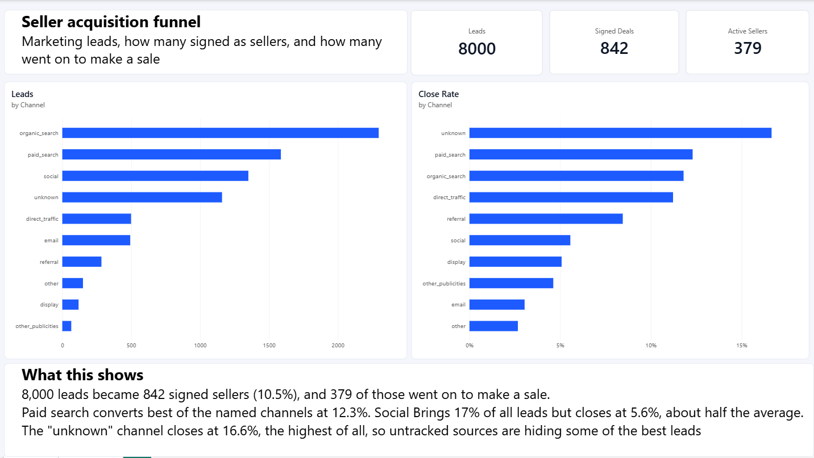
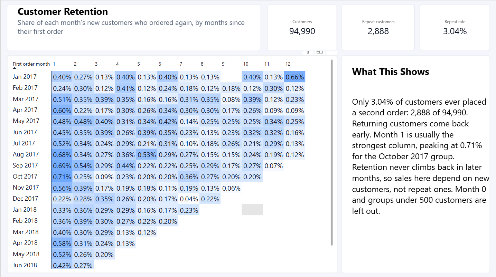

# Olist Analytics Engineering (dbt + DuckDB)

[](https://github.com/AshokReddy010/olist-analytics-engineering/actions/workflows/ci.yml)

An end-to-end analytics engineering project on the public Olist e-commerce and marketing funnel datasets. Raw CSV files are modelled with dbt into tested, documented tables in DuckDB, then used for a Power BI dashboard and a lead-scoring model.

Everything runs on a laptop with no cloud account: clone, install, `dbt build`.

## What it answers

1. **Seller acquisition:** which marketing channels bring leads that actually sign as sellers, and how many of those go on to make a sale?
2. **Customer retention:** do customers come back after their first order?
3. **Lead scoring:** can the sales team tell, on the day a lead arrives, which leads are worth calling first?

## Findings

### Seller acquisition funnel



- 8,000 marketing leads became 842 signed sellers (10.5%), and 379 of those went on to make a sale.
- Paid search converts best of the named channels at 12.3%. Organic search brings the most leads (2,296) and closes at 11.8%.
- Social brings 17% of all leads but closes at 5.6%, about half the average. Email closes at 3.0%.
- Leads with an "unknown" origin close at 16.6%, the highest of all, so untracked sources are hiding some of the best leads. Fixing the tracking would be the first recommendation.
- The median signed lead takes 14 days from first contact to close.

### Customer retention



- Only 3.04% of customers ever placed a second order: 2,888 of 94,990.
- The few who return tend to do it early. Month 1 is usually the strongest column, peaking at 0.71% for the October 2017 cohort, and retention does not recover in later months.
- Sales in this marketplace depend almost entirely on new customers, not repeat ones.

### Lead scoring

A logistic regression predicts whether a lead will sign, using only what is known on the day of first contact (channel, landing page and weekday). It is trained on the first 6,000 leads and tested on the 2,000 most recent ones, so it is always judged on leads that came after the ones it learned from.

| Model | ROC AUC | Average precision | Close rate in top 10% of scores | Lift over average |
|:--|--:|--:|--:|--:|
| Channel close rate only (baseline) | 0.613 | 0.143 | 19.5% | 1.85x |
| Logistic regression | 0.690 | 0.190 | 23.0% | 2.18x |

- The average close rate in the test period is 10.5%. Calling only the 200 highest-scored leads would reach leads that close at 23.0%, about 46 sellers instead of 21.
- This is a modest model. A simple rule (rank leads by their channel's past close rate) already gives 1.85x, so the landing page and weekday add a real but limited improvement on top of the channel.
- With so few features it is a way to order a call list, not a replacement for sales judgement.

## Data quality checks that found something

The project has 80 dbt tests. Three are set to warn rather than fail, because they describe real problems in the source data that are worth reporting, not hiding:

| Check | Result |
|:--|:--|
| Every product category has an English translation | 2 categories are missing from the translation file (13 products). The model falls back to the Portuguese name. |
| Payments reconcile to order value | 249 of 98,665 orders (0.25%) differ by more than 1.00, a net difference of 2,870.39. |
| Days to close is not negative | 1 of 842 signed leads has a close date 2 days before its first contact date. |

## How it is built

```
data/raw (10 CSV files)
   └─ staging        10 views   rename, cast types, clean keys
       └─ intermediate  6 views   sum order items and payments, latest review, join
           └─ marts         8 tables  facts, dimensions and reporting tables
```

| Mart | Rows | What it is |
|:--|--:|:--|
| `fct_orders` | 99,441 | One row per order, with order number per customer. Incremental with a 3-day lookback. |
| `fct_order_items` | | One row per item sold |
| `dim_customers` | 96,096 | One row per customer, with cohort month, lifetime value and repeat flag |
| `dim_products`, `dim_sellers` | | Product and seller attributes |
| `fct_lead_funnel` | 8,000 | One row per marketing lead, from first contact to first sale |
| `mart_funnel_by_origin` | 10 | Funnel counts and close rate per channel |
| `mart_cohort_retention` | 220 | Retention by first-order month and months since |

- **Tests:** unique and not-null keys, relationships between tables, accepted values, `dbt_utils` checks, and a custom reconciliation test in `tests/`.
- **CI:** GitHub Actions runs `dbt build` on every push, then builds `fct_orders` a second time to prove the incremental logic works.
- **Dashboard:** `dashboard/olist_dashboard.pbix` (Power BI) with a custom theme and DAX measures.

## Run it yourself

Needs Python 3.10 or newer. Commands are for Windows CMD.

```
git clone https://github.com/AshokReddy010/olist-analytics-engineering.git
cd olist-analytics-engineering
python -m venv .venv
.venv\Scripts\activate
pip install -r requirements.txt
dbt deps
dbt build
```

Expected result: `PASS=101 WARN=3 ERROR=0 TOTAL=104`.

Optional extras:

```
pip install scikit-learn pandas tabulate
python scripts\lead_scoring.py
python scripts\export_marts.py
```

`lead_scoring.py` writes its results to `analysis/`. `export_marts.py` writes CSV files to `exports/` for Power BI.

## Tools

dbt-core, dbt-duckdb, DuckDB, dbt_utils, SQL, Python (pandas, scikit-learn), Power BI (DAX), GitHub Actions.

## Data

[Brazilian E-Commerce Public Dataset by Olist](https://www.kaggle.com/datasets/olistbr/brazilian-ecommerce) and [Marketing Funnel by Olist](https://www.kaggle.com/datasets/olistbr/marketing-funnel-olist), both from Kaggle. Orders run from 2016 to 2018; marketing leads from June 2017 to May 2018.

## Author

Ashok Reddy Bhimavarapu · [Portfolio](https://ashokreddy010.github.io) · [LinkedIn](https://www.linkedin.com/in/ashokreddy1)
